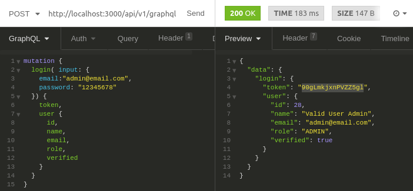
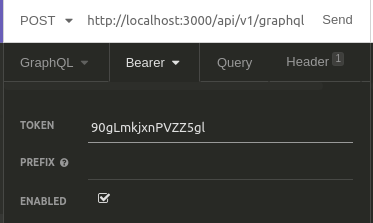
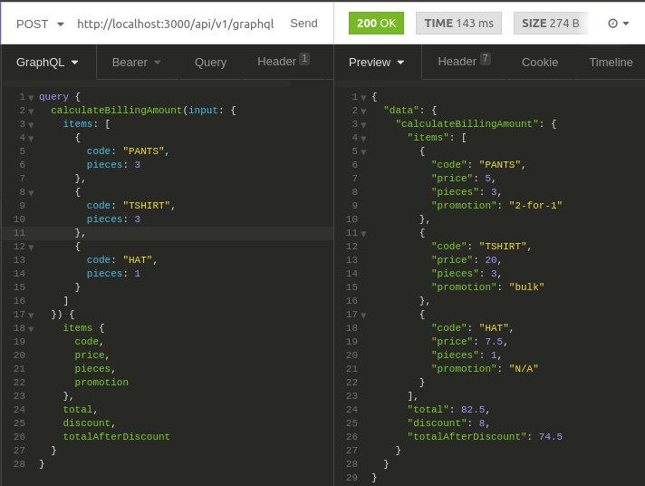

# Shopping-cart-v2

API that calculates the total amount to be pay from a sell.

## **Before start**

This API was made with didactic purposes. The databases don't contain sensitive information.

## Instalation
You need to install the following technologies

* Docker

* aws-cli: Used to read an set environment variables that should be secret like data base credentials.

Here are a summary of the installation commands that you can cut and paste to run as a single set of commands.

```
url "https://s3.amazonaws.com/aws-cli/awscli-bundle.zip" -o "awscli-bundle.zip"
unzip awscli-bundle.zip
sudo ./awscli-bundle/install -i /usr/local/aws -b /usr/local/bin/aws
```

* jq: Used to inject aws secrets into docker containers

If you are using macOS you can install it using brew. If you are using a linux distribution you can use this commands.

```
sudo apt-get update
sudo apt-get install jq
```

## Configuration
aws-cli uses credentials to access into aws services. this project uses aws secrets. You need to set up your own credentials like this.

* .aws/credentials
```
[shopping-cart]
aws_access_key_id = * access key *
aws_secret_access_key = * secret key *
```

* .aws/config
```
[profile shopping-cart]
region = us-east-1
```
___

## How it works

This project uses the information below.

## Items and prices

| Code        | Name    | Price   |
| ----------- |:-------:| ------: |
| PANTS       | Pants   | $5.00   |
| TSHIRT      | T-Shirt | $20.00  |
| HAT         | Hat     | $7.50   |

## Promotions

* **2-for-1**: buy two of the same product, get one free.
* **bulk purchases**: buying x or more of a product, the price of that product is reduced.

For now:

* Pants are 2-for-1.
* Buy 3 or more T-shirts and the price will be $19.00 per unit.

## Examples

Items: PANTS, TSHIRT, HAT \
Total: $32.50

Items: PANTS, TSHIRT, PANTS \
Total: $25.00

Items: TSHIRT, TSHIRT, TSHIRT, PANTS, TSHIRT \
Total: $81.00

Items: PANTS, TSHIRT, PANTS, PANTS, HAT, TSHIRT, TSHIRT \
Total: $74.50

## Example using Insomnia software
* First you need to login and use the response token



* Use that token



* Make a request


___
### important to know

You can change **prices** and **items assign to promotions** without modify a single code line and the API will works. But if you want to add a new promotion, you must define the promotion behavior in ```servcies/api/src/api/helpers/utils.js```

Example:

```javascript
const promotionsLogic = {
    '2-for-1': (pieces, price) => {
        return Math.trunc(pieces / 2) * price;
    },
    'bulk': (pieces, price) => {
        return pieces >= 3 ?(price * 0.05) * pieces : 0;
    },
};
```

___


## How to run this proyect

* Run project in integration mode to be used by frontend devs
```
make integration
```

* To shut down integration mode.
```
make dev-down
```

* Run project in testing mode. It will run all test, unit and functional.
```
make test
```

* To shut down testing mode
```
make test-down
```

## Run project in developer mode
```
make dev
```
If you use this mode you need to enter into api container using bash

```
make bash
```
Then you can run those commands

* Start nodemon
```
root@0bbdb6c0ba30:/var/lib/app# nodemon
```

* Run unit test
```
root@0bbdb6c0ba30:/var/lib/app# make unit-test
```

* Run functional test
```
root@0bbdb6c0ba30:/var/lib/app# make functional-test
```
* Run database seeds (It run automatically when service is starting, but you can modify seeds and run it again)

```
root@0bbdb6c0ba30:/var/lib/app# node integration_seeds/
```
